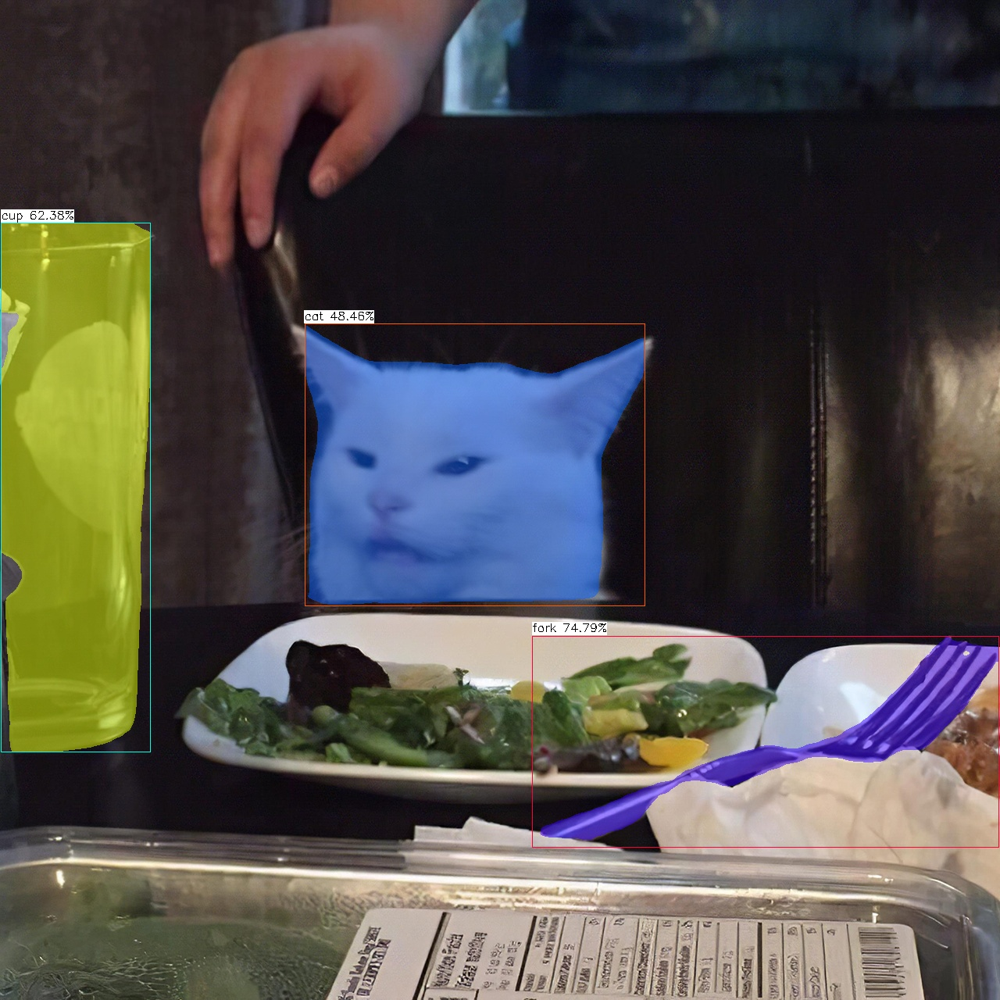
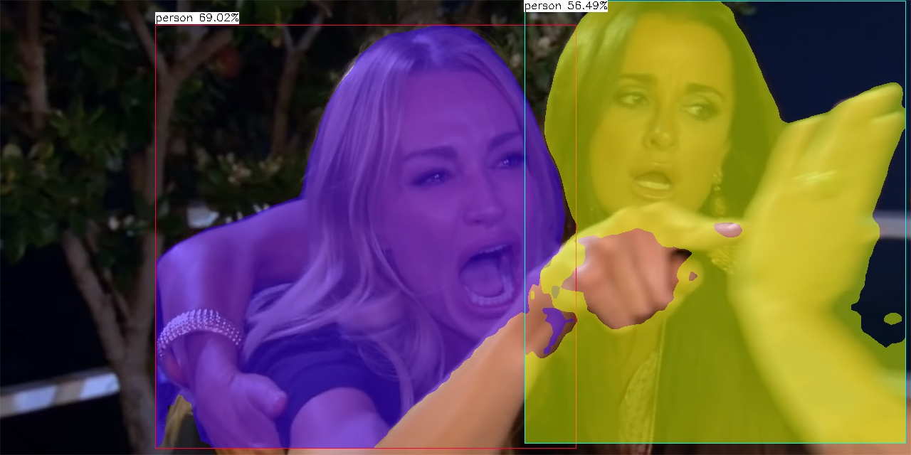

# Yolov5 Segmentation with NCNN



# Setup
Setup for windows, using visual studio 2022. Refer to [build](./build/build.md)

Or download the window x64 [release](https://github.com/canh25xp/Yolov5-segmentation-ncnn/releases/tag/v1.0)

# How to run
1. Put NCNN model (.bin and .param) to the "./models" folder.
2. Put inference image to "./input" folder
3. Run yolov5-seg.exe in cmd ( assumed that the *.bin and *.param are both in models folder )
```cmd
yoloncnn [-model] [-data] [-input] [-size] [-conf] [-nms] [-dynamic] [-save]
```
-model : ncnn model name. Default yolov5s-seg.ncnn

-data : class names txt file. Default coco128.txt

-input : images ( *jpg, *png,... ), videos ( *mp4, *mov,... ), 0 for webcam

-size : target size. Default 640

-conf : confident threshold. Default 0.25

-nms : nms threshold. Default 0.45

-dynamic : dynamic dectec flag. Default false

-save : save output flag. Default false

For example :
```cmd
yoloncnn -input woman.jpg -model yolov5x-seg.ncnn -dynamic -save
```


4. Output saved at "/output" folder

# How to convert pytorch model to ncnn model 
Currently, there's 2 ways to convert a pytorch model to ncnn model : 
1. pytorch >> onnx >> ncnn 
2. pytorch >> torchscript >> ncnn (via [pnnx](https://github.com/pnnx/pnnx))

The author himself( or maybe her ) ([nihui](https://github.com/nihui)) recommended the **second method** (refer to [this comment](https://github.com/Tencent/ncnn/issues/4488#issuecomment-1434299765))

# MEME PLACE
Scientists : AI is going to take over the world.

Mean while AI :
