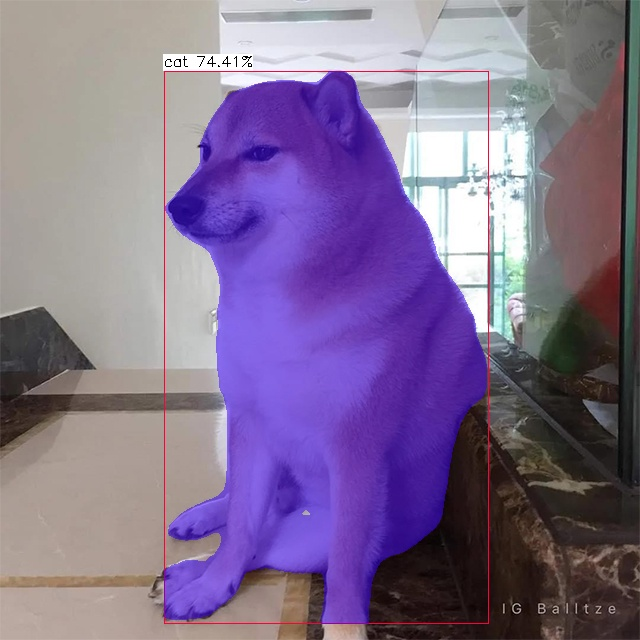

# Yolov5 Segmentation with NCNN


# Setup
Setup for windows 10, using visual studio 2022. Refer to [build](./build/build.md)

Or download the window x64 [release](https://github.com/canh25xp/Yolov5-segmentation-ncnn/releases/tag/v1.0)

# How to run
1. Put NCNN model (.bin and .param) to the "../models" folder.
2. Put inference image to "../input" folder and data file ( *.txt ) to "../data" folder ( See the tree below )
```         
+---data
|       coco128.txt
|       
+---input
|       test.bmp
|       cat.jpg
|       cat.mp4
|
+---models
|       yolov5s-seg.ncnn.bin
|       yolov5s-seg.ncnn.param
|
+---output
|       cat.jpg
|       cat.mp4
\---Yolov5-seg
        yoloncnn.exe
```  
3. Run yolov5-seg.exe in cmd ( assumed that the *.bin and *.param are both in models folder )
```cmd
yoloncnn [--model]
         [--data]
         [--source]
         [--output]
         [--size]
         [--conf]
         [--nms]
         [--max-obj]
         [--dynamic]
         [--agnostic]
         [--contour]
         [--save]
         [--save--text]
         [--crop]
         [--rotate]

```
model : ncnn model name. Default yolov5s-seg.ncnn

data : class names txt file. Default coco128.txt

source : images ( *jpg, *png,... ) ; videos ( *mp4, *mov,... ) ; 0 for webcam ; or . for run all images in input folder. Default "test.bmp"

size : target size. Default 640

conf : confident threshold. Default 0.25

nms : nms threshold. Default 0.45

dynamic : dynamic inference flag.

agnostic : agnostic nms flag.

contour : draw contour instead of mask flag.

save : save output flag.

save-text : save output label to a text file flag.

crop : crop output flag.

rotate : rotate output flag.

For example :
```cmd
yoloncnn --input cat.jpg --model yolov5s-seg.ncnn --dynamic --save --agnostic
```
```cmd
5 argument(s) passed
model     = ..\models\yolov5s-seg.ncnn.bin
param     = ..\models\yolov5s-seg.ncnn.param
input     = ..\input\cat.jpg
data      = ..\data\coco128.txt
size      = 640
conf      = 0.25
nms       = 0.45
maxObj    = 100
dynamic   = 1
noseg     = 0
agnostic  = 1
crop      = 0
save      = 1
saveTxt   = 0
saveMask  = 0
------------------------------------------------
Inference time = 0.194 (seconds)
Objects count = 5
42 0.775778 496 459 719 568
15 0.551823 214 237 467 436
41 0.381012 2 170 104 538
42 0.318674 590 459 716 546
45 0.308080 92 444 581 615
Output saved at ..\output\cat.jpg
```


# How to convert pytorch model to ncnn model 
Currently, there's 2 ways to convert a pytorch model to ncnn model : 
1. pytorch >> onnx >> ncnn 
2. pytorch >> torchscript >> ncnn (via [pnnx](https://github.com/pnnx/pnnx))

The author himself( or maybe her ) ([nihui](https://github.com/nihui)) recommended the **second method** (refer to [this comment](https://github.com/Tencent/ncnn/issues/4488#issuecomment-1434299765))

# MEME PLACE
Scientists : AI is going to take over the world.

Mean while AI :


