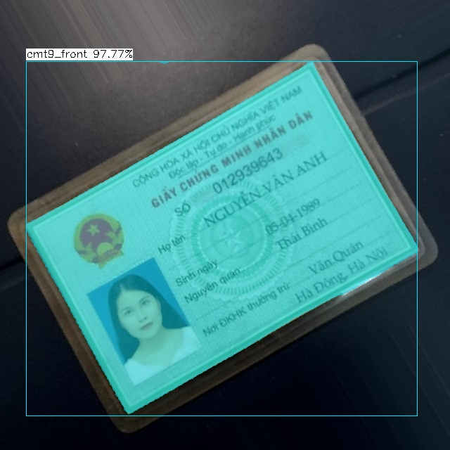
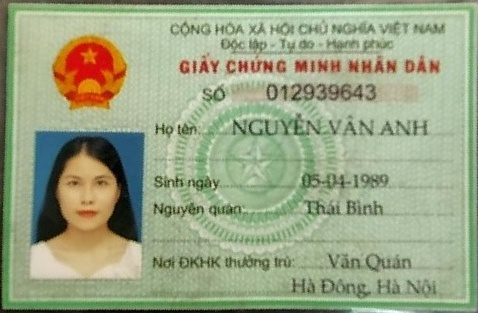

# Yolov5 Segmentation with NCNN

> This branch is for ID card recognition and rotation



## Setup

Setup for windows 10, using visual studio 2022. Refer to [build](./build/build.md)

## How to run

1. Put NCNN model (.bin and .param) to the "models" folder.
2. Put inference image to "input" folder
3. Put class names text file ( *.txt ) to "data" folder ( See the tree below )
4. Run yolov5-seg.exe in cmd ( assumed that the *.bin and*.param are both in models folder )

```
+---data
|       idcard.txt
|       
+---input
|       00.jpg
|       01.jpg
|       02.jpg
|       ...
|
+---models
|       yolov5s-seg-idcard-best.ncnn.bin
|       yolov5s-seg-idcard-best.ncnn.param
|       yolov5s-seg-idcard-2.ncnn.bin
|       yolov5s-seg-idcard-2.ncnn.param
|
+---output
|       00.jpg
|       01.jpg
|       02.jpg
|       ...
|
+---Yolov5-seg
|       yoloncnn.exe
```  

```
Usage

yoloncnn [option] <value>

Options
    --model <ncnn model name>           = Explicitly specify the ncnn model name. Default yolov5s-seg-idcard-2.ncnn
    --data <class names txt file>       = Explicitly specify the class names txt file. Default idcard.txt
    --source <input source>             = Explicitly specify the input source. Default test.jpg
    --output <output folder>            = Explicitly specify the output folder. Default output
    --size <target size>                = Specify the target size. Default 640
    --conf <confident threshold>        = Specify the confident threshold. Default 0.25
    --nms <nms threshold>               = Specify the nms threshold. Default 0.45
    --max-obj <max objects detection>   = Specify the max objects detection. Default 1
    --dynamic                           = Dynamic inference flag. Default false
    --agnostic                          = Agnostic nms flag. Default false
    --contour                           = Draw contour instead of mask flag. Default false
    --save                              = Save output flag. Default false
    --save--text                        = Save output label to a text file flag. Default false
    --crop                              = Crop output flag. Default false
    --rotate                            = Rotate output flag. Default false
```

Note :
source can be :

- image path
- videos path
- 0 for webcam
- . for run all images in input folder

For example :

```
yoloncnn --source test.jpg --model yolov5s-seg-idcard-2.ncnn --save --rotate
```

```
4 argument(s) passed
model     = ..\models\yolov5s-seg-idcard-2.ncnn.bin
param     = ..\models\yolov5s-seg-idcard-2.ncnn.param
input     = ..\input\test.jpg
data      = ..\data\idcard.txt
size      = 640
conf      = 0.25
nms       = 0.45
maxObj    = 1
dynamic   = 0
contour   = 0
agnostic  = 0
crop      = 0
save      = 1
saveTxt   = 0
saveMask  = 0
rotate    = 1
------------------------------------------------
Inference time = 0.188 (seconds)
Objects count = 1
5 0.977652 37 87 594 591
Output saved at ..\output\test.jpg
```



## How to convert pytorch model to ncnn model

Currently, there's 2 ways to convert a pytorch model to ncnn model :

1. pytorch >> onnx >> ncnn
2. pytorch >> torchscript >> ncnn (via [pnnx](https://github.com/pnnx/pnnx))

The author himself( or maybe her ) ([nihui](https://github.com/nihui)) recommended the **second method** (refer to [this comment](https://github.com/Tencent/ncnn/issues/4488#issuecomment-1434299765))