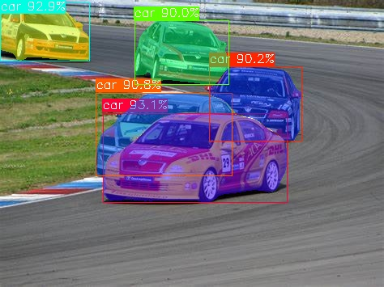
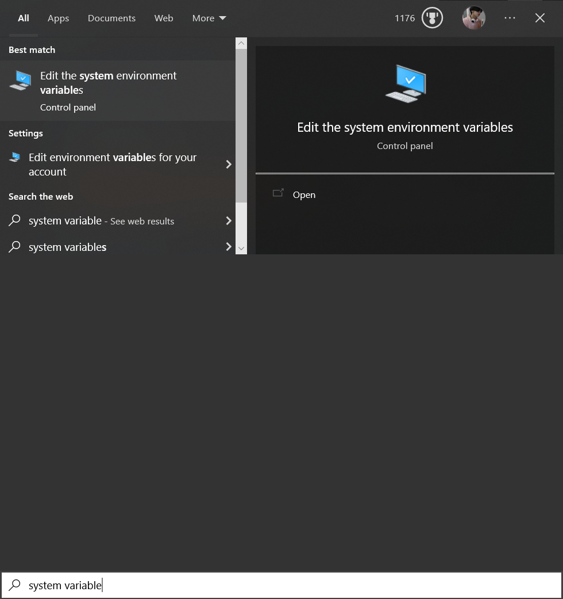
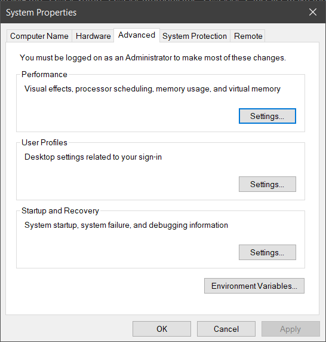
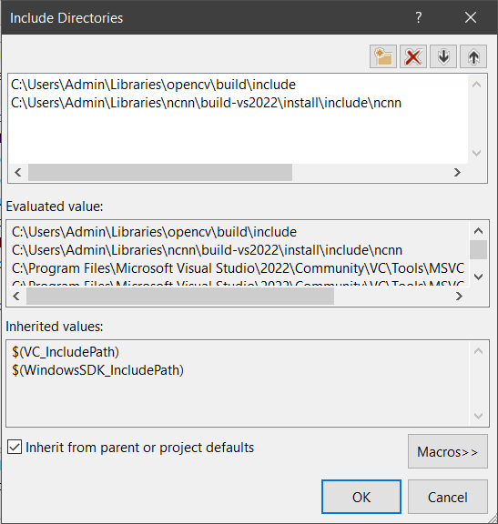
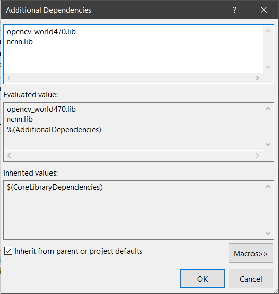
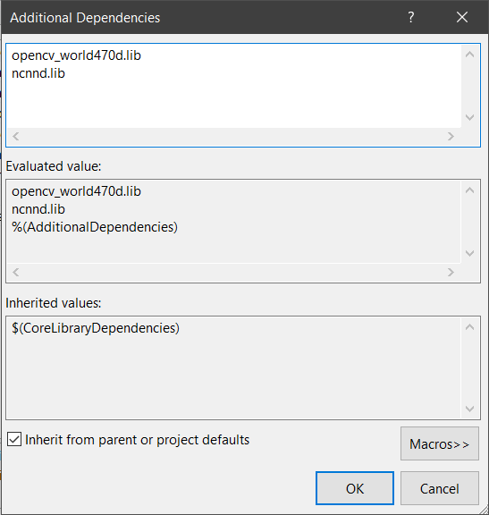
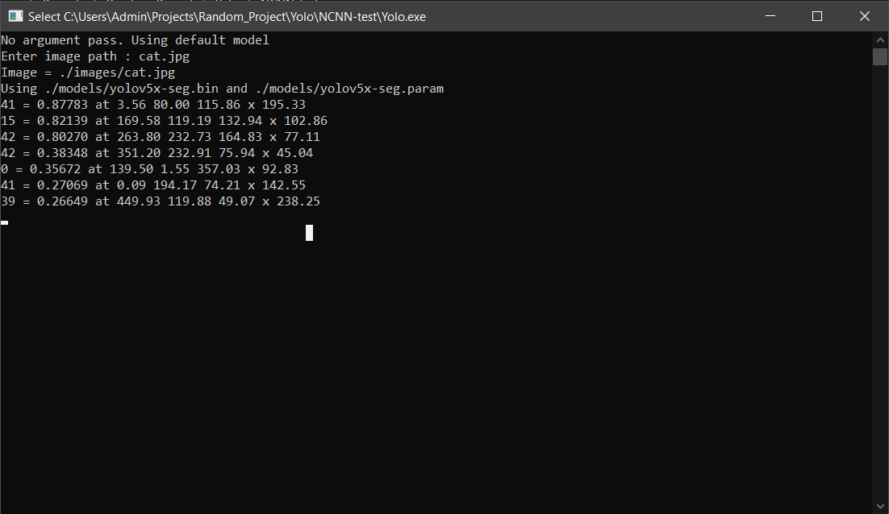
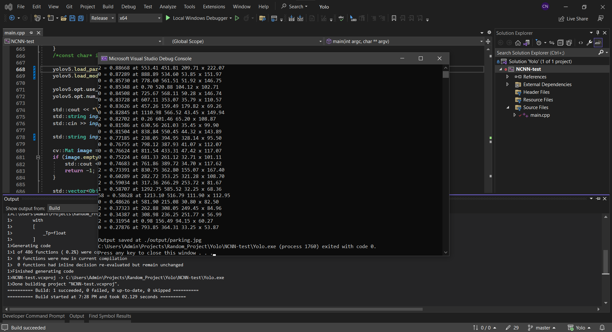

# Yolov5 Segmentation

# Setup
Setup for windows, using visual studio 2022
## Prerequisites
### 1. Install Visual Studio 2022 [download visual studio community](https://visualstudio.microsoft.com/vs/community/)

### 2. Install Cmake [download cmake](https://cmake.org/download/)
1. First, Get the lastest cmake pre-compiled binary on this [download page](https://cmake.org/download/).
2. If download the Windows MSI installer. During installation, remember to select the option "Add Cmake to the system Path (for all users or current user)". Then you can skip step 3.

3. If that is not selected during installation or if you download from a zip file, you need to manually add the install directory (e.g. C:\Program Files\CMake\bin) to the system variable : *Edit the system enviroment variables > Enviroment variables... > Path > Edit > New >*




### 3. Install OpenCV framework [OpenCV Github repository](https://github.com/opencv/opencv)
1. Download and install the [latest release](https://github.com/opencv/opencv/releases/). For me, it is the "opencv-4.7.0-windows.exe"
2. Add the bin folder to the Environment Variables path : *\opencv\build\x64\vc16\bin*


### 4. Install The Tencent's NCNN framework [NCNN Github repository](https://github.com/Tencent/ncnn)
To build for Visual Studio, refer to [this](https://github.com/Tencent/ncnn/wiki/build-for-VisualStudio.en#compile-and-install-ncnn-library-and-model-conversion-tool) tutorial

## Setup Visual Studio Project
1. Create a New Visual Studio project C++ console
2. Set the platform target to x64
3. Add Directories by going to *Project>Properties>Configuration Properties>VC++ Directories*. Add opencv and ncnn include folder to *Include directories* and add library folder to *Library Directories*



4. Add Dependencies by going to *Project>Properties>Configuration Properties>Linker>Input*. Add opencv and ncnn *.lib* to *Additiona Dependencies* (d for debug, without d for release )
 

# How to run
1. Put ncnn model (.bin and .param) to "./NCNN-test/models". Models can be download at [Google Drive](https://drive.google.com/drive/folders/1KtMrWS-zh73aBp44aSUf3gM6vX587VBG)
2. Put inference image to "./NCNN-test/images"
3. Run yolo.exe or run in cmd, just pass the model name, assum the *.bin and *.param are both in models folders
```cmd
yolo [model name] [image name]
```
for example :
```cmd
yolo yolov5x-seg cat.jpg
```

4. If you dont pass any argument. Type the images name e.g : *cat.jpg*
 
5. Output saved at "NCNN-test/output" folder

# How to convert pytorch model to ncnn model 
Currently, there's 2 ways to convert a pytorch model to ncnn model : 
1. pytorch >> onnx >> ncnn 
2. pytorch >> torchscript >> ncnn (via [pnnx](https://github.com/pnnx/pnnx))

The author himself( or maybe her ) ([nihui](https://github.com/nihui)) recommended the **second method** (refer to [this comment](https://github.com/Tencent/ncnn/issues/4488#issuecomment-1434299765))