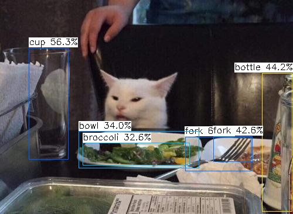
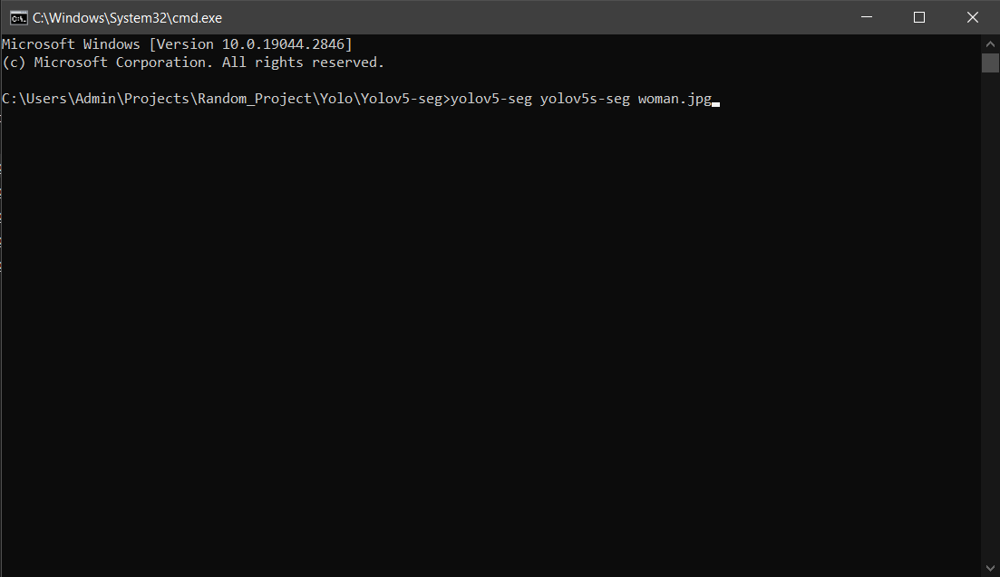
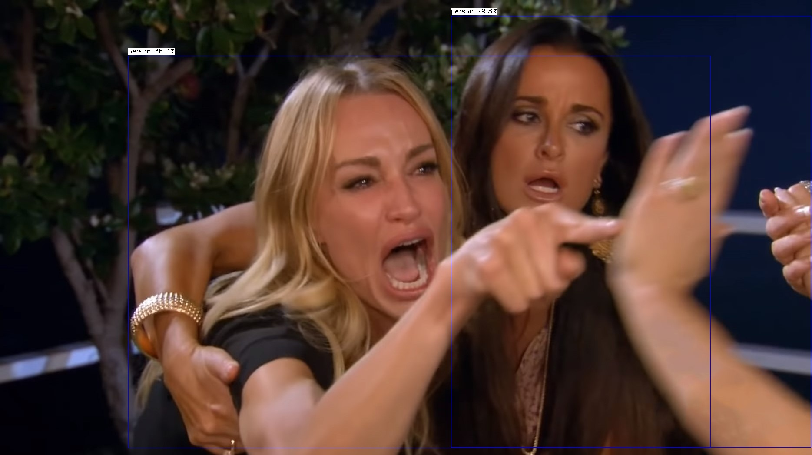

# Yolov5 Segmentation with NCNN



# Setup
Setup for windows, using visual studio 2022. Refer to [build](./build/build.md)

Or download the window x64 [release](https://github.com/canh25xp/Yolov5-segmentation-ncnn/releases/tag/v1.0)

# How to run
1. Put NCNN model (.bin and .param) to the "./models" folder. Models can be download at [Google Drive](https://drive.google.com/drive/folders/1KtMrWS-zh73aBp44aSUf3gM6vX587VBG)
2. Put inference image to "./input" folder
3. Run yolo.exe or run in cmd, just pass the model name, assumed that the *.bin and *.param are both in models folder
```cmd
yolov5-seg [model name] [input]
```
Input can be : 
- images ( *jpg, *png,... ) (Press anykey to close image after)
- videos ( *mp4, *mov,... ) (Press 'q' or 'esc' to close video)
- 0 for webcam (Press 'q' or 'esc' to close webcam)

For example :
```cmd
yolov5-seg yolov5s-seg woman.jpg
```



4. If you dont pass any argument, the default model "yolov5-seg" is used
5. Output saved at "/output" folder

# How to convert pytorch model to ncnn model 
Currently, there's 2 ways to convert a pytorch model to ncnn model : 
1. pytorch >> onnx >> ncnn 
2. pytorch >> torchscript >> ncnn (via [pnnx](https://github.com/pnnx/pnnx))

The author himself( or maybe her ) ([nihui](https://github.com/nihui)) recommended the **second method** (refer to [this comment](https://github.com/Tencent/ncnn/issues/4488#issuecomment-1434299765))
